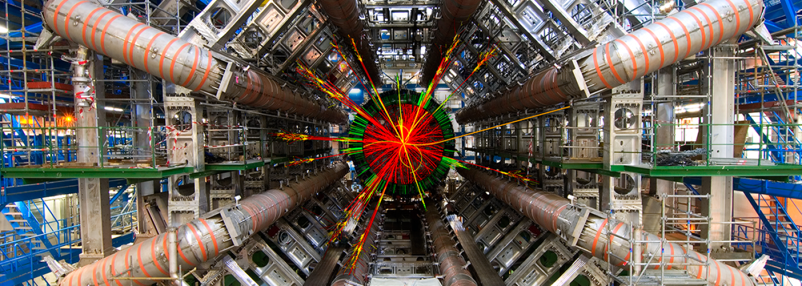





# **The ATLAS Open Data 13 TeV release**

The aim of the 13 TeV ATLAS Open Data is to **provide data and tools** to high school, undergraduate and graduate students, as well as teachers and lecturers, to help educate and train them in analysis techniques used in experimental particle physics. Sharing data collected by the ATLAS experiment aims to generate excitement and enthusiasm for fundamental research, inspiring physicists of the future.

The following documentation provides **introductory material and detailed information** for a wide audience about the ATLAS experiment, the released 13 TeV ATLAS Open Datasets and their visualisation, the analysis frameworks and ROOTbooks, as well as the virtual machine usage instructions.

---

## General information

+ The 13 TeV ATLAS Open Data is hosted in the [ATLAS Open Data website](http://opendata.atlas.cern), as well as in the [CERN Open Data website](http://opendata.cern.ch/) and are attributed separate DOI's that allow their citation.
+ The main ATLAS-approved document meant to be a guide on the content, properties, capabilities and limitations of the released datasets is: [ATL-OREACH-PUB-2020-001](https://cds.cern.ch/record/2707171), please cite accordingly.

---
