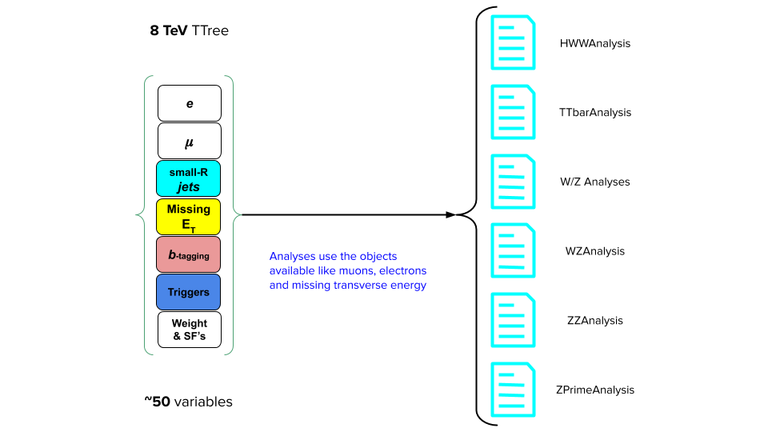

# **... ATLAS Open Data samples**

The 8 TeV [ATLAS Open Data](http://opendata.atlas.cern) dataset is comprised of real data recorded with the ATLAS detector in 2012 and matching simulated data. [It was launched in 2016](https://atlas.cern/updates/atlas-news/explore-lhc-data-new-atlas-educational-platform) together with an analysis framweork and 7 different examples in Python.

Both real and simulated data is subjected to a loose event preselection to reduce processing time by reducing the overall number of events that have to be analysed.

These simulated datasets correspond to the data collected by the ATLAS experiment in 2012.
&nbsp;

# Follow the [Legacy 8 TeV Documentation](http://opendata.atlas.cern/books/current/openatlasdatatools/_book/)

&nbsp;

&nbsp;

# Follow the [Legacy 8 TeV Documentation](http://opendata.atlas.cern/books/current/openatlasdatatools/_book/)

&nbsp;

---

## Are you looking for the [13 TeV](../samples-13tev/) samples?

---

## <a name="atlas-disclaimer">Disclaimer</a>
This dataset is provided by the ATLAS Collaboration only for educational purposes and is not suited for scientific publications.
* The [ATLAS Open Data](http://opendata.atlas.cern) are released under the [Creative Commons CC0 waiver](http://creativecommons.org/publicdomain/zero/1.0/).
* Neither ATLAS nor CERN endorses any works produced using these data, which is intended only for educational use.
* All data sets will have a unique [DOI](https://en.wikipedia.org/wiki/Digital_object_identifier) that you are requested to cite in any (non-scientific) applications or publications.
* Despite being processed, the high-level primary datasets remain complex, and selection criteria need to be applied in order to analyse them, requiring some understanding of particle physics and detector functioning.
* The large majority of the data cannot be viewed in simple data tables for spreadsheet-based analyses.

---
